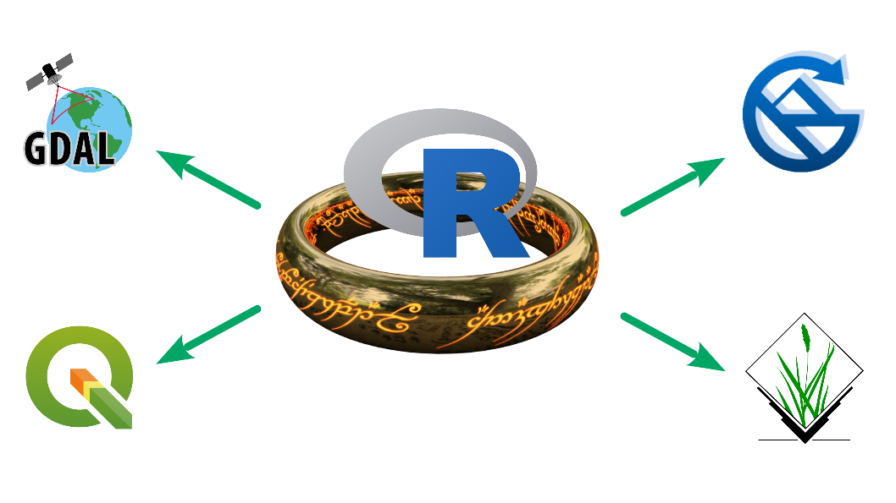
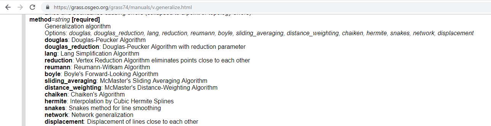
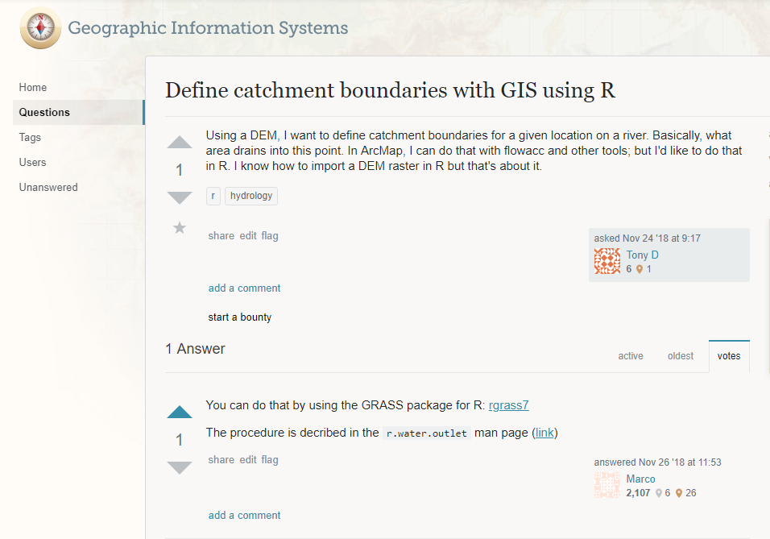

```{r setup, include=FALSE}
knitr::opts_chunk$set(echo = TRUE)

library(RSAGA)
library(here)
library(raster)
library(gdalUtils)
library(RQGIS3)
set_env("C:/OSGeo4W64")
qgis_session_info()
```

## Introduction

.large[
- R est puissant, mais pas toujours assez...  
- Il fait plein de choses, mais pas toujours tout...
- Il est paramétrable, mais il manque parfois certaines options...
]

```{r, out.height="400px", echo=F}

```

---

## Plan de la présentation

.large[
- Pensez spatial, pas data.frame,
- Les limites du package `raster` et les options externes,
- Les options externes comme plan B à R,
- Inconvénient de sortir de R
- Conclusion
]


---

## Pensez spatial!

Par défaut, on a tendance à tout remettre en `data.frame` lorsqu'on travail en R.  C'est facile, il y a une tonne d'outils et on est habitué. Cependant, ce n'est pas toujours approprié.

Basé sur une histoire vrai.

J'hérite d'un code qui doit appliquer différentes opérations sur des rasters:
-  Filtrer les valeurs,
-  Substituer certaines valeurs qui respecte une règle précise,
-  Multiplier des valeurs,
-  Appliquer un modèle

```{r eval=FALSE}
le.raster <- raster(r, layer=8)
en.point <- rasterToPoints(le.raster, fun=function(x){x>5}) 
coord <- as.data.frame(en.point[,1:2])
```

--

.content-box-desj[
  .center[.large[.bold[`rasterToPoints` et `as.data.frame` à éviter comme Mordor!
  ]]]]


---

## Pensez spatial!

Plutôt, tout faire en raster grâce aux outils tels:
-  calculatrice raster
-  reclassification

--

Gain de plus de 10x en vitesse avec pratiquement pas de RAM nécessaire! 

---

## Les limites du package raster

Le package `raster` est un excellent package avec une tonne d'outils et de fonctionnalité.  Il est intuitif et facile à utiliser.  Je le conseil fortement.  Cependant, il peut parfois être très lent et non efficace.

Exemple de reprojection d'une image landsat<sup>1</sup>:


```{r, warning=F, message=F}
library(magrittr)
library(here)
library(tictoc)

tocOutMsg <- function(tic, toc, msg) paste(msg, " : ", round(toc - tic), " sec", sep="")

base.rast <- list.files("data/landsat/nord",
                        pattern = ".TIF$", 
                        full.names = T) %>% 
  grep("B2|B3|B4|B5",., value = T)

epsg32198 <- "+proj=lcc +lat_1=60 +lat_2=46 +lat_0=44 +lon_0=-68.5 +x_0=0 +y_0=0 +ellps=GRS80 +datum=NAD83 +units=m +no_defs"

```

.footnote[[1] Image Landsat OLI-8 du path 013 row 027 le 06-09-2016 disponible sur [earthexplorer](https://earthexplorer.usgs.gov/) ]

---

## Les limites du package raster

### Reprojection d'une image landsat :


.pull-left[Avec le package `raster`
```{r, warning=F, message=FALSE, cache=T}
library(raster)
ras.brut.ras <- stack(base.rast)
tic("Temps total Raster")
ras.32198.ras <- projectRaster(ras.brut.ras,
                               crs = CRS(epsg32198))
toc(func.toc = tocOutMsg)
```
]

--

.pull-right[Avec le package `gdalUtils`
```{r, warning=F, message=FALSE, cache=T}
library(gdalUtils)
tic("Temps total gdalUtils")
for(i in base.rast){
 gdalwarp(srcfile = i,
          dstfile = here("temp_files",
                           basename(i)),
          t_srs = epsg32198,
          overwrite = T
          )
}
toc(func.toc = tocOutMsg)
```
]


---

## Les limites du package raster

### Rééchantillonnage


.pull-left[Avec le package `raster`
```{r, warning=F, message=FALSE, cache=T}
tic("Temps total Raster")
gabarit <- raster(nrows=12169, ncols=12007,
                  xmn=-295600, xmx=-55460,
                  ymn=264340, ymx=507720, 
                  crs=CRS(epsg32198),
                  resolution=c(20,20))
ras.resamp <- resample(ras.32198.ras, 
                       gabarit, 
                       filename = paste0("temp_files/",
                                         "morph_raster_",
                                         basename(base.rast)[1]),
                       bylayer=TRUE,
                       overwrite=TRUE)
toc(func.toc = tocOutMsg)
```
]

--

.pull-right[Avec le package `gdalUtils`
```{r, warning=F, message=FALSE, cache=T}
tic("Temps total gdalUtils")
for(i in base.rast){
  gdalwarp(srcfile = i,
           dstfile = paste0(here("temp_files"),
                            "/morph_utils_",
                            basename(i)),
           t_srs = epsg32198,
           tap=T,
           tr=c(20,20),
           overwrite = T
  )
}
toc(func.toc = tocOutMsg)
```
]


---

## Un plan B intéressant

Si l'application existe en R, parfois une autre version existe ailleurs.

Exemple de la simplification de shapefile<sup>1</sup>

.pull-left[Simplification de polygones en R:
```{r, eval = F}
ua <- st_read("data/UNITE_AMENAGEMENT.shp") %>% 
  st_transform(32198)

ua_simple <- st_simplify(ua, dTolerance = 10)
```
]

--

.pull-right[Ou en GRASS à travers QGIS
```{r, eval = F}
library("RQGIS3")
set_env("C:/OSGeo4W64")
qgis_session_info()

find_algorithms(search_term = "generalize")
get_usage(alg = "grass7:v.generalize")

ua_simple_rqgis <- 
  run_qgis(alg = "grass7:v.generalize",
           input = here("data/UNITE_AMENAGEMENT_32198.shp"),
           output = here("temp_files/ua_simple_grass.shp"),
           error = here("temp_files/ua_simple_grass_error.shp"),
           type="1",
           threshold = "10",
           load_output = TRUE)
```
]

.footnote[[1] Unités d'Aménagements forestières obtenues sur [Données Québec](https://www.donneesquebec.ca/recherche/fr/dataset/unite-d-amenagement/resource/99aa6dd4-ef2c-49e9-a472-77e383eed538])

---

## Un plan B intéressant

Les logiciels spaciaux libres ont souvent une boite à outils très complètes avec plusieurs méthodes et arguments disponibles.

Par exemple, la simplification de polygones en GRASS permet 5 algorithmes de simplification (le reste sont des algorithmes de smoothing)


```{r, echo=F}

```


---

## Si ce n'est pas disponible en R

```{r, echo=F, fig.align="center"}

```


---

## Si ce n'est pas disponible en R

Répondons à la question et faisons un bassin versant pour la rivière Sainte-Anne-du-Nord à Beaupré<sup>1</sup>. 

```{r, message=F, warning=F, results=F, , cache=T}
gdal_translate(here("data", "cdem_dem_021M.tif"),
               here("temp_files", "dem_temp.tif"),
               projwin = c(-71.2, 47.5, -70.5, 47))

#get_usage(alg = "grass7:r.watershed")

run_qgis(alg = "grass7:r.watershed",
         elevation = here("temp_files", "dem_temp.tif"),
         threshold = 5000,
         drainage = here("temp_files/drain.tif"))

#get_usage(alg = "grass7:r.water.outlet")

bassin_grass <- run_qgis(alg = "grass7:r.water.outlet",
                         input = here("temp_files/drain.tif"),
                         output = here("temp_files/bassin_grass.tif"),
                         coordinates="-70.8837037458,47.0692354224",
                         load_output = TRUE)
```

.footnote[[1] Le MNT provient de http://ftp.geogratis.gc.ca/pub/nrcan_rncan/elevation/cdem_mnec/021/
]
---

## Si ce n'est pas disponible en R

```{r, message=F, warning=F, out.height="400px"}
library(leaflet)
leaflet(width = "100%") %>% addTiles() %>%
  addRasterImage(bassin_grass,  opacity = 0.5)
```


---

## Pas satisfait, faite le en SAGA!

```{r, message=F, warning=F, results="hide", cache=T, comment=FALSE, error=FALSE}
library(RSAGA)

rsaga.fill.sinks(in.dem = here("temp_files", "dem_temp.tif"), 
                 out.dem = here("temp_files", "no.sink.sgrd"),
                 out.wshed = here("temp_files", "bassin_saga.sgrd"),
                 method = "wang.liu.2006")

bassin_saga <- raster(here("temp_files", "bassin_saga.sdat"))

bassin_saga[bassin_saga!=1307] <- NA
```


---

## Pas satisfait, faite le en SAGA!

```{r, message=F, warning=F, out.height="400px"}
leaflet(width = "100%") %>% addTiles() %>%
  addRasterImage(bassin_saga, color="blue", opacity = 0.5)
```


---


## R appelle la console


Si un logiciel que vous voulez utiliser a un CLI (interface de commande), vous pouvez l'appeller directement en R à l'aide de la function `system` et ainsi l'intégrer à même votre flux de travail.

Exemple d'analyse de vent avec Wind Ninja (https://weather.firelab.org/windninja/)


```{r, echo=F, out.width = "500px", fig.align="center"}
knitr::include_graphics("https://raw.githubusercontent.com/firelab/windninja/master/images/bsb.jpg")
```


---

```{r}
wind_ninja <- function(num_threads=1, elevation_file, input_speed, input_speed_units="kph", output_speed_units="kph",
                  input_direction, input_wind_height=10, units_input_wind_height="m",
                  output_wind_height=10, units_output_wind_height="m", vegetation,
                  mesh_resolution, units_mesh_resolution="m", 
                  output = c("write_ascii_output", "write_wx_model_ascii_output"),
                  output_path = NULL, momentum_flag = NULL,
                  initialization_method = "domainAverageInitialization"){
  command <- paste(
    "C:/WindNinja/WindNinja-3.3.2/bin/WindNinja_cli.exe",
    "--num_thread", num_threads, 
    "--elevation_file", elevation_file, 
    "--input_speed", input_speed,
    "--input_speed_units", input_speed_units,
    "--output_speed_units", output_speed_units,
    "--input_direction", input_direction,
    "--input_wind_height", input_wind_height,
    "--units_input_wind_height", units_input_wind_height,
    "--output_wind_height", input_wind_height,
    "--units_output_wind_height", units_input_wind_height,
    "--vegetation", vegetation,
    "--mesh_resolution", mesh_resolution,
    "--units_mesh_resolution", units_mesh_resolution,
    paste(paste(paste0("--", output), collapse = " true "), "true"),
    ifelse(is.null(output_path), "", paste0("--output_path ",output_path)),
    ifelse(momentum_flag==T, "--momentum_flag true", ""),
    "--initialization_method", initialization_method,
    sep = " "
  )
 system(command) 
}
```

---

## R appelle la console

```{r, message=F, warning=F, results=F, cache=T, comment=FALSE}
gdalwarp(here("temp_files", "dem_temp.tif"),
         here("temp_files", "dem_temp_32198.tif"),
         t_srs = epsg32198, 
         te = c(-202000, 337700, -151800, 391100),
         tr = c(100,100),
         overwrite = T)

wind_ninja(num_threads=7, elevation_file=here("temp_files", "dem_temp_32198.tif"),
      input_speed = 23, input_direction = 23, vegetation = "trees", mesh_resolution = 100,
      output = "write_ascii_output", output_path = here("temp_files"))

speed <- raster(here("temp_files", "dem_temp_32198_23_23_100m_vel.asc"))
ang <- raster(here("temp_files", "dem_temp_32198_23_23_100m_ang.asc"))
```

---

## R appelle la console

```{r, message=F, warning=F, result=F, cache=T, fig.align="center"}
library(rasterVis)
vectorplot(stack(speed, ang), unit = 'degrees', isField=T, xlim=c(-189000,-186000), ylim=c(346000, 349000), narrows=1e5)
```


---


## Inconvénients

Cette méthode de travailler n'est pas parfaite:

--

-  Créé plusieurs fichiers temporaires plutôt de travailler en mémoire comme R

--

-  L'installation de `gdal` et autres logiciels peut être complexe et problématique dans les environnements corporatifs 
  -  SAGA n'a pas besoin de droits d'administrateurs

--

-  Beaucoup d'intermédiaire (R -> RQGIS3 -> QGIS -> GRASS) ce qui décuple les risques de bugs et les sites github

--

- GRASS est compliqué si utilisé seul (et même à travers `RGRASS7`)

--

- Les messages d'erreur sont souvent cryptiques:
    -  `Warning message:In system(cmd, intern = TRUE) :  running command ... had status 1`
  
  
  
---

## Résumé

- Packages intéressants :
  -  `gdalUtils` : Alternative performante à `raster`,
  -  `RQGIS3` : Toute la puissance de QGIS à un seul endroit,
  -  `RSAGA` : Pour le matriciel et le vectoriel, simple, sans droit d'administrateur,
  -  `RGRASS7` : Compliqué mais une option de plus,
  -  Function `system` : Pour tout autre lien, spatial ou non.

--

  
- Functions utilitaires :
  -  `list.files` : Lister l'ensemble des fichiers d'un dossier,
  -  `dir.create` : Créer un dossier,
  -  `file.remove`, `unlink` : Effacer un fichier,
  -  `tempdir`, `tempfile` : Créer un dossier ou fichier temporaire,
  -  `file.rename` : Renommer un ficher, 
  -  `paste`, `paste0` : Concaténer de chaines de caractères
  -  etc.

--

.content-box-desj[
  .center[.Large[.bold[Si R est trop lent, incomplet, pas exactement ce que vous avez besoin, n'hésitez pas et aller voir ailleurs!]]]
]

---

## Merci!